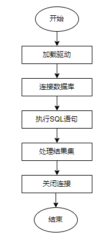

## 开发流程

### 1.1 整体流程

采用仓颉语言开发应用程序的流程如下：



### 1.2 具体流程

1. 开发应用程序需要导入仓颉标准库的std.database.sql包和opengauss.driver包

   ```cangjie
   import std.database.sql.*
   import cangjie_tpc::opengauss.driver.*
   ```

2. 加载驱动

   1. 通过DriverManager的getDriver函数加载驱动，例如：

      ```cangjie
      DriverManager.getDriver("opengauss")
      ```

3. 连接数据库

   1. 通过驱动对象，根据连接串，获取数据源对象

      ```
      ds = drv.open(url)
      ```

   2. 通过数据源对象，连接数据库，获取连接对象

      ```
      conn = ds.connect()
      ```

4. 执行SQL语句

   1. 通过连接对象和SQL语句，获取Statement对象

      ```
      statement = conn.prepareStatement(sql)
      ```

   2. 增删改查

      1. 设置参数值

         ```
         statement.set<参数类型>(参数位置，参数值)   # 参数位置从1开始
         ```

      2. 增删改、表定义等语句的执行

         ```
         updateresult = statement.update()
         ```

      3. 查询

         ```
         queryResult = statement.query()
         ```

5. 处理结果集

   1. 判断是否有下一行数据

      ```
      queryResult.next()
      ```

   2. 获取数据

      ```
      queryResult.get<返回值类型>(返回值位置)  # 返回值位置从1开始
      ```

6. 关闭连接

   ```
   conn.close()
   ```

   